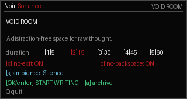
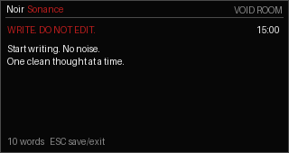

# Void Room

Offline writing room for NoirSonance Cardputer Zero and regular Linux desktops.

Void Room is a distraction-free writing space for raw thought. Choose a timer, optionally lock yourself out of backspace or early exit, and write without turning the session into editing.

Features:

- Timed writing rooms for focused drafting.
- Optional no-exit and no-backspace modes.
- Local archive for saved writing sessions.
- Cardputer Zero and regular Linux desktop launch modes.

## Screenshots




## Install

Use the install helper:

```bash
curl -fsSL https://raw.githubusercontent.com/rimedag/voidroom_cardputerzero/main/install.sh | sh
```

Or download the package for your machine:

```bash
ARCH="$(dpkg --print-architecture)"
curl -LO "https://raw.githubusercontent.com/rimedag/voidroom_cardputerzero/main/pool/main/v/void-room/void-room_0.1.0-noirsonance2_${ARCH}.deb"
sudo apt install "./void-room_0.1.0-noirsonance2_${ARCH}.deb"
```

## Launch

Cardputer Zero / small display:

```bash
void-room-cardputerzero
```

Regular Linux desktop or Raspberry Pi HDMI desktop:

```bash
void-room-desktop
```

Automatic mode:

```bash
void-room
```

## Packages

Public downloads are architecture-specific binary builds:

- `amd64` for regular Linux desktops and laptops.
- `arm64` for Cardputer Zero and 64-bit Raspberry Pi OS.
